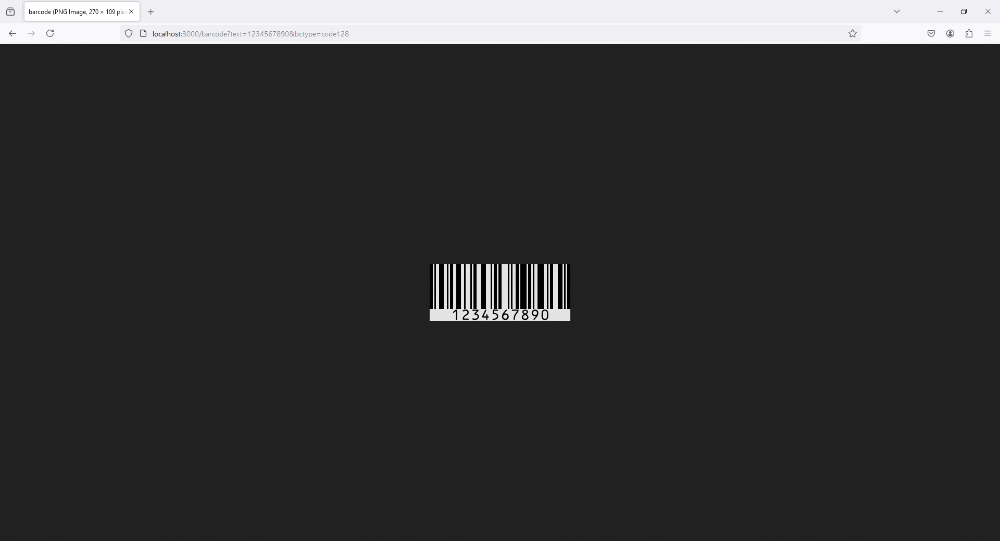

# Creating a Barcode API with Node.js - Using bwip-js
 
To install the necessary dependencies for your Express server that generates barcodes, you can use the following command:

Here's a brief description of each package:

- `express`: The web framework for handling HTTP requests and responses.

```
npm i express
```

- `canvas`: A library for creating and manipulating canvas elements.

```
npm i canvas 
```

- `bwip-js`: A library for generating barcodes.

```
npm i bwip-js
```

`.env`
```
PORT=3000
```

`.server.js`
```
const express = require('express');
const bwipjs = require('bwip-js');
const app = express();
const port = 3000;

app.get('/barcode', (req, res) => {
  const { text, bctype } = req.query;

  if (!text || !bctype) {
    return res.status(400).send('Missing text or barcode type.');
  }

  bwipjs.toBuffer({
    bcid: bctype,        // Barcode type
    text: text,          // Text to encode
    scale: 3,            // 3x scaling factor
    height: 10,          // Bar height, in millimeters
    includetext: true,   // Show human-readable text
  }, (err, png) => {
    if (err) {
      return res.status(500).send(err.toString());
    }
    res.type('png');
    res.send(png);
  });
});

app.listen(port, () => {
  console.log(`Barcode API listening at http://localhost:${port}`);
});
```

`postman`

GET -> http://localhost:3000/barcode?text=1234567890&bctype=code128

Key Points

- bwip-js: A library for generating barcodes in Node.js.
  
- Barcode Types: Common types include code128, ean13, qr, etc.

- Scaling and Height: Adjust scale and height to fit your needs.

This basic setup should get you started with a barcode API using Node.js. You can extend it with additional features like authentication, error handling, or different barcode formats.

