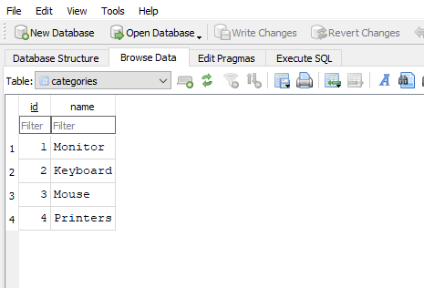

# Node.js Has a Built-In SQLite Module Now! ⚡ 
```
https://www.youtube.com/shorts/scrB5xqhhlU
```

```js
import { DatabaseSync } from 'node:sqlite';

// Open a database file (or use ':memory:' for an in-memory database)
const database = new DatabaseSync('shop.db');

// Execute a SQL statement to create a table
database.exec(`
  CREATE TABLE IF NOT EXISTS categories (
    id INTEGER PRIMARY KEY AUTOINCREMENT,
    name TEXT
  )
`);

// Use prepared statements for secure data insertion
const insert = database.prepare('INSERT INTO categories (name) VALUES (?)');
insert.run('Monitor');
insert.run('Keyboard');
insert.run('Mouse');
insert.run('Printers');

// Retrieve data
const query = database.prepare('SELECT * FROM categories ORDER BY name');
console.log(query.all());

// Close the database connection
database.close();
```

