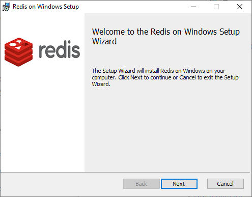
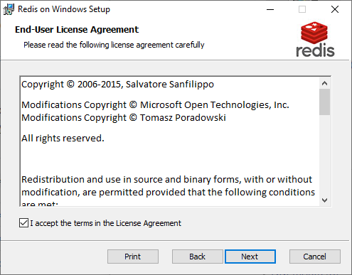
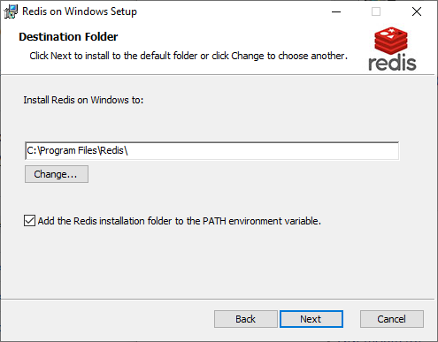
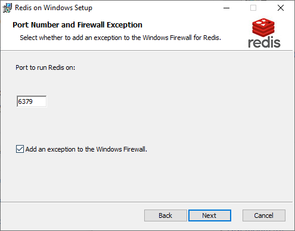
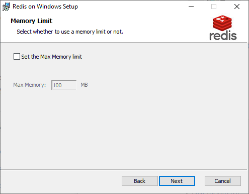
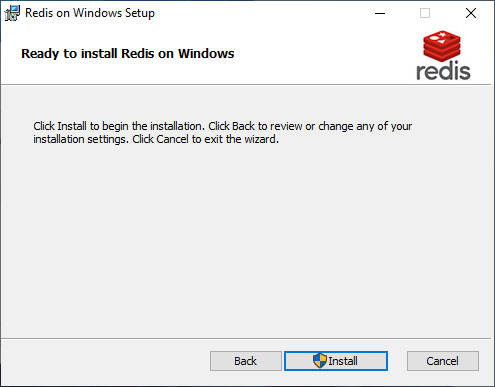
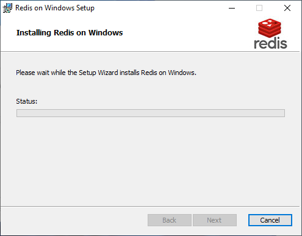
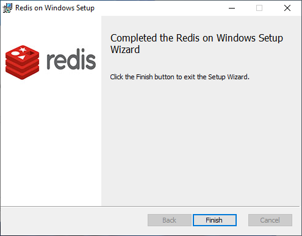

#  How to Install Redis On Windows 11 and 10 
```
https://www.youtube.com/watch?v=gzAI6NZO8Ug
```










```
redis-server
```

```
[22388] 12 Jul 13:12:36.591 # oO0OoO0OoO0Oo Redis is starting oO0OoO0OoO0Oo
[22388] 12 Jul 13:12:36.591 # Redis version=5.0.14.1, bits=64, commit=ec77f72d, modified=0, pid=22388, just started
[22388] 12 Jul 13:12:36.592 # Warning: no config file specified, using the default config. In order to specify a config file use redis-server /path/to/redis.conf
[22388] 12 Jul 13:12:36.594 # Could not create server TCP listening socket *:6379: bind: An operation was attempted on something that is not a socket.
```

```
C:\Program Files\Redis\redis-cli.exe
```

```
127.0.0.1:6379> ping
PONG
127.0.0.1:6379>
```